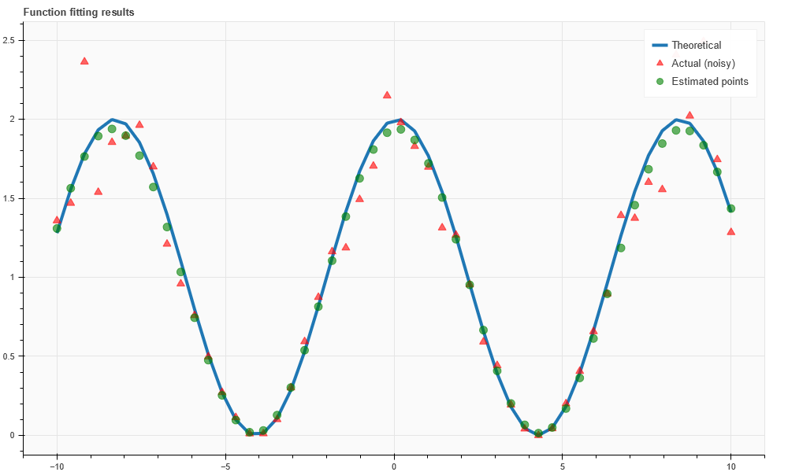

# GAPy

A *minimalistic* yet full of power implementation of Genetic Algorithms (GAs).

---

GAPy is a flexible GA framework designed for **minimization** problems. It is completely customizable in terms of coding of the solution although it embeds several ready-to-use functions for *real-coded GA*.
